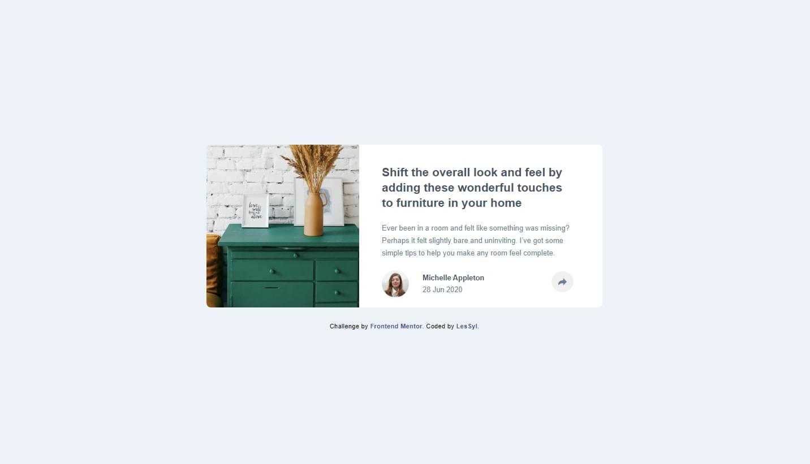
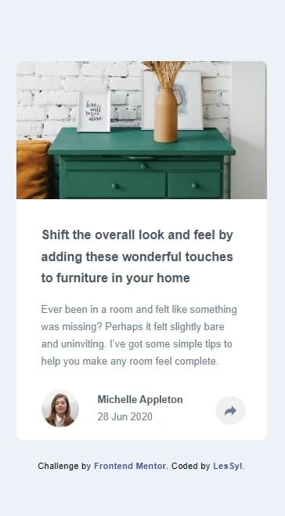
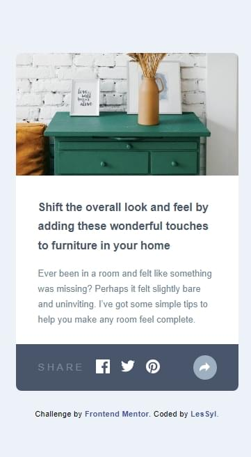

# Frontend Mentor - Article preview component solution

This is a solution to the [Article preview component challenge on Frontend Mentor](https://www.frontendmentor.io/challenges/article-preview-component-dYBN_pYFT). Frontend Mentor challenges help you improve your coding skills by building realistic projects. 
# Frontend Mentor - Testimonials grid section solution

## Table of contents
- [Overview](#overview)
  - [Screenshot](#screenshot)
  - [Links](#links)
- [My process](#my-process)
  - [Built with](#built-with)
  - [What I learned](#what-i-learned)
- [Author](#author)

## Overview

### Screenshot

Desktop

Mobile

### Links

- Repository URL:[GitHub](https://github.com/LesSyl/Article-preview-component)
- Solution URL: [Frontendmentor]()
- Live Site URL: [Live](https://lessyl.github.io/Article-preview-component/)
## My process

### Built with

- Semantic HTML5 markup
- Mobile-first workflow
- Sass
- BEM
- Flexbox
- Grid
- JS

### What I learned
It's a project I've had a lot of fun with, but I've also learnt a lot. First and foremost, I learned how to combine html, CSS and JS. Thanks to this solution, I know how the code should be created in html and how to oscillate it in order to easily enrich it in JS.

## Author

- Frontend Mentor - [@LesSyl](https://www.frontendmentor.io/profile/LesSyl)
- gitHub - [@LesSyl](https://github.com/LesSyl)